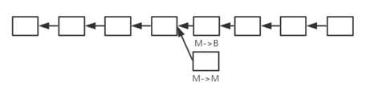

# 课程：北京大学肖臻老师《区块链技术与应用》公开课

笔记参考：北大肖臻老师《区块链技术与应用》公开课笔记——这应该是全网最好的区块链公开课

以及 https://blog.csdn.net/Mu_Xiaoye/article/details/104299664


# 比特币BitCoin

## BTC密码学原理篇

比特币属于[加密](https://so.csdn.net/so/search?q=加密&spm=1001.2101.3001.7020)货币，可见其中必然会涉及到密码学的知识。而比特币本身开放，其交易记录、交易金额、交易内容甚至源代码都面向全网开放，加密又使用在哪里呢？在比特币中，正是加密确保了信息的不可篡改，保证了区块链本身的优势——不可篡改。

在比特币系统中，加密主要涉及两个内容：

**==hash（哈希）==** 两个重要性质collision resistance（对哈希碰撞具有抗拒性）和hiding(隐藏性)

**collision resistance用处：**
如果我们自己有一条信息x，我们希望别人知道我有x但不想让别人知道x具体是什么，就可以通过告诉其Hash(x)，由于该性质，保证了x!=y时，Hash(x)和Hash(y)是不相等的。我们只需要告诉别人Hash(x)即可，对方可以通过Hash(x)知道你确实知道x这个信息，但他无法（很难）通过Hash(x)反推出x。

**hiding：**
我们认为，给定x和Hash(),可以很容易得到Hash(x),但没有办法在已知Hash(x)和Hash()的情况下，反推出x的具体取值，当然这也是一个理想的情况。

**collision resistance和hiding结合实现digital commitment(数据保证)：**
		在视频中，肖老师提到关于股市预测的案例，某个人对某个股票进行涨停预测，我们如何保证能够知晓其预测是否准确？最简单的是提前公布，等待实际结果出现后验证。但实际中，当提前发布预测后，可能会由于预测者本身对股市实际结果造成影响。所以，应该将提前将其写于纸上并密封，交给第三方机构保管，等到实际结果出现后开启密封与实际对比，这就是digital commitment。而第三方机构需要能够使人信服，在实际生活中，有很多场景并不存在一个这样的第三方机构，而区块链技术正为此提供了一个很好的解决方法。
我们把预测结果看作x，提前公布Hash(x)，等到预测结果发生时间来临后，公布x，如果根据x可以得到公布的Hash(x)，则说明公布的x确实为所预先预测的内容。从而，我们可以实际进行判断预测是否准确。实际使用中，为了x足够大，会对x进行“加盐”，对x拼接一个nonce，对其整体取Hash。

**Puzzle friendly**
在比特币系统中，还需要第三个性质Puzzle friendly。该性质要求哈希值计算事先不可预测，仅仅根据输入很难预测出输出。例如：我们需要一个哈希值，存在于某一个范围内，只能通过不停运算查找出来。该性质保证了比特币系统中，只能通过“挖矿”获得比特币。也就是说，该性质保证了工作量证明(POW)机制可以运行下去【“挖矿难，但验证易”】。在比特币系统中采用SHA-256哈希函数

==***签名***==
比特币中账户管理
在第三方中心化系统中，账户开通依赖于第三方。但去中心化的比特币系统中，很明显不能进行“申请账户”。在比特币系统中，申请账户是用户自己来处理的，即自己创建一个公钥-私钥对。（关于公私钥请自行了解非对称加密体系和对称加密体系）
公钥和私钥的应用保证了“签名”的应用。当在比特币网络中进行转账时，通过“签名”可以明确是由哪个账户转出的，从而防止不良分子对其他账户比特币的盗取。
在发布交易时，通过自己私钥签名，其他人可以根据公钥进行验证，从而保证该交易由自己发起。也就是说，只有拥有私钥，才能将该账户中的比特币转走。
【注意：比特币系统中，很难通过生成大量公私钥对来获取他人私钥】

## BTC数据结构篇

==**[Hash](https://so.csdn.net/so/search?q=Hash&spm=1001.2101.3001.7020) pointer（哈希指针）**==

**指针**
在程序运行过程中，需要用到数据。最简单的是直接获取数据，但当数据本身较大，需要占用较大空间时，明显会造成一定麻烦。因此，可以引入指针这一概念。当需要获取数据时，只需要按照指针所给的地址，去对应的位置读取数据即可，这样大大节省了内存空间。
在实际中，为了便于程序移植性等原因，指针实际上存储的是逻辑地址而非物理地址。

区块链结构本身为一条链表，节点为区块。而传统链表实现，便是通过指针将各个节点串联起来而称为最终的链。如下便是我们最常见的一个链表：


但在区块链系统中，并未采用指针，而是使用了**哈希指针**

**哈希指针**
如下图对于该节点，我们可以看到有两个指针指向这个节点（实际上为一个），其中P为该节点的地址，H()为该节点的哈希值，该值与节点中内容有关。当节点（区块）中内容发生改变，该哈希值也会发生改变，从而保证了区块内容不能被篡改。


在比特币中，其最基本的数据结构便是一个个区块形成的区块链。

**区块链与链表区别1：哈希指针代替普通指针**
如图为一个简单的区块链。其中，每个区块根据自己的区块内容生成自己的哈希值，此外，每个区块（除创世纪块）都保存有前一个区块的哈希值。需要注意的是，本区块哈希生成依赖于本区块内容，而本区块内容中又包含有前一个区块的哈希值。从而保证了区块内容不被篡改。

如图中所示，如果我们想要破坏区块链完整性。篡改B的内容，而C中保存有B的哈希值，所以C也得进行修改。而同样C后区块也得修改。而用户只需要记住最后一个区块链的哈希地址，就可以检测区块链上内容是否被篡改。
在实际应用中，一整条链可能会被切断分开保存在多个地方。若用户仅仅具有其中一段，当用到前面部分区块数据时，直接问系统中其他节点要即可，当要到之后，仅仅通过计算要到的最后一个哈希值和自己保存哈希值是否一致可以判断所给内容是否确实为区块链上真实的内容。


==***Merkle Tree(默克尔树)***==

Merkle Tree是比特币系统中又一个重要的数据结构。首先，回顾一下Binary Tree(如果不懂请自行复习数据结构)。Merkle Tree和Binary Tree的区别有哪些？

**1.Merkle Tree用哈希指针代替了普通指针**


上图即为一个简单的Merkle Tree，其中A、B、C、D为数据块。可见，A和B各有一个哈希值，将其合并放在一个节点中，C和D同样操作，而后，针对得到的两个节点分别取哈希，又可以得到两个新的哈希值，即为图中根节点。实际中，在区块块头中存储的是根节点的哈希值（对其再取一次哈希）。
如视频中图片：


该数据结构的优点在于：只需要记住Root Hash（根哈希值），便可以检测出对树中任何部位的修改。
例如，所绘制Merkle Tree中节点B发生了改变，则对应的第二层第一个节点中第二个哈希值便也会发生改变，进而根节点中第一个哈希值也会发生改变，从而导致根哈希值也发生了改变。


```
在比特币系统中，不同区块通过哈希值指针连接，在同一个区块中的多个交易（数据块），则通过Merkle Tree的形式组织在一起。区块本身分为两部分（块头和块身），在块头中存在有根哈希值（没有交易的具体信息），块身中存在交易列表。
```

**2.Merkle Tree的实际用途**
Merkle Tree可以用于提供Merkle Proof。关于Merkle proof，需要先了解比特币系统中节点。比特币中节点分为**轻节点**和**全节点**。全节点保存整个区块的所有内容，而轻节点仅仅保存区块的块头信息。

```
为什么要分轻节点和全节点？
因为硬件的局限。一个区块大小为1MB，对于移动便携设备来说，如果存储区块的所有内容，则所需空间过大，而这是不现实的。所以轻节点只需要存储区块块头信息，全节点存储区块所有内容即可。
```

当需要向轻节点证明某条交易是否被写入区块链，便需要用到Merkle proof。我们将交易到根节点这一条路径称为Merkle proof，全节点将整个Merkle proof发送给轻节点（如下图所示），轻节点即可根据其算出根哈希值，和自己保存的对比，从而验证该交易是否被写入区块链。只要沿着该路径，所有哈希值都正确，说明内容没有被修改过。


思考：是否存在不安全的情况？如下图我们要验证B，但是H(1)和H(4)都是全节点提供的。全节点可否修改B，通过H(1)调整，使得修改过后的H(1)和轻节点计算出的H(2)一起取得哈希仍然为H(3)？


实际上，这种情况为人为制造哈希碰撞。而由于公开课笔记2中可知，由于哈希函数的collision resistance性质，这种情况是不会发生的。从而，保证了系统的不可篡改性。同时，这样一个Merkle Proof的事件复杂度为O(log n),非常高效【证明交易存在】。如果要证明交易不存在，如果不对叶节点规定排序顺序，没有一个效率较高的方法证明不存在。
在比特币系统中，没有相应的需求，所以在比特币系统中并没有对Merkle Tree进行排序。
一般来说，一般的链表我们都可以改造为使用哈希指针的链表，但当链表中存在环时，哈希指针便不能再使用。


## BTC共识协议篇

==***[数字货币](https://so.csdn.net/so/search?q=数字货币&spm=1001.2101.3001.7020)中经常出现的问题***==

- 双花攻击
  数字货币本身为带有签名的数据文件，可以进行复制。即：对用户来说，可以将同一货币花费两次。

> 修改：对货币添加唯一编号（不可篡改），每次支付向货币发行单位查询真伪。
> 该方法每次交易都需要依赖于第三方机构来判断货币真伪且防止双花攻击。是一个典型的第三方中心化方案。现实中，我们通过支付宝、微信、信用卡等各种支付方式交易时，必然会依赖于第三方机构。由于这些第三方机构具有较高的可信度，有政府进行背书，所以可以采用这种方案。
> 但是，很多场景下，并不存在这样一个可信赖的第三方机构。基于这个背景，以去中心化思想为核心的比特币系统便吸引了人们的注意力


> 修改：对货币添加唯一编号（不可篡改），每次支付向货币发行单位查询真伪。
> 该方法每次交易都需要依赖于第三方机构来判断货币真伪且防止双花攻击。是一个典型的第三方中心化方案。现实中，我们通过支付宝、微信、信用卡等各种支付方式交易时，必然会依赖于第三方机构。由于这些第三方机构具有较高的可信度，有政府进行背书，所以可以采用这种方案。
> 但是，很多场景下，并不存在这样一个可信赖的第三方机构。基于这个背景，以去中心化思想为核心的比特币系统便吸引了人们的注意力


**==*去中心化需要解决的问题*==**

- 数字货币的发行由谁执行？如何发行？发行多少？什么时候发行？
  在传统中心化货币体系中，这些问题我们可以交给第三方机构（如：央行）。当引入去中心化思想后，系统中节点平等，交易不通过第三方，那么货币发行权的分配必然是一个需要解决的问题。

（在比特币系统中由挖矿来决定货币发行权和发行量。）

- 如何验证交易是否有效？如何防止双花攻击？
  同样，在传统中心化体系中，该问题的解决由第三方机构来完成。而剔除这一机构后，交易双方如何能够验证交易的有效性？如何防止系统中恶意用户作恶获取收益？这也是去中心化交易系统需要解决的问题。


该问题的解决，依赖于系统中维护的一个数据结构，记录货币的使用情况（是否被花过？被谁花过？）。该数据结构由系统中全体用户共同维护，保证了交易的有效性。该数据结构，便是区块链。

**==案例说明==**

如下，假定A获得铸币权，新新发布了10个比特币（该交易称为铸币交易）。A将10个比特币转给了B(5个)和C(5个)，A对该交易进行签名，同时该交易需要说明所花掉10个比特币来源（来自铸币交易）。之后，B将自己的5个比特币转给C(2个)和D(3个)，该交易需要B的签名，该交易需要说明所花掉的5个比特币来自于第二个交易中。然后，C将自己所拥有的全部7个比特币都转给E，并对该交易签名，可以发现该交易中C的比特币来源于两个交易中。这样，就构成了一个简单的区块链。【红色部分为比特币来源】


需要注意的是，这里面有两种哈希指针。第一种为指向前面的区块（白色），使得各个区块形成链，第二种则是为了说明比特币的来源（红色）。说明比特币的来源并非凭空捏造，可以防止双花攻击。
在进行交易时，需要付款人的签名和收款人的地址，在比特币系统中，该地址即为收款人的公钥的哈希。可以将其视为银行账户，根据此进行转账交易。（虽然公钥可以公开，但实际中更多公开的是公钥的哈希）
在交易中，收款方需要知道付款方的公钥，从而验证A签名是否有效。即A需要提供自己的公钥，如果所提供公钥与铸币交易中。（实际上其他节点都需要知道付款方公钥，验证交易合法性）实际中A转账时候提供的公钥需要和铸币交易中公钥对的上，这样就防止了恶意节点伪造A的公钥来“偷”走A的比特币。
		在比特币系统中，通过执行脚本实现上述验证过程。将当前交易输入脚本与前一个交易输出脚本（说明币的来源的交易）拼接执行，如果可以正确执行，说明交易合法。
在该图中，一个区块仅含有一个交易，实际中一个区块中包含多个交易，交易通过Markle Tree（详见比特币数据结构篇中）组织起来，在区块中存储。

==***比特币区块信息***==

block Header（区块宏观信息）	block body(略)
Version(版本协议)	…
Hash of previous block header（指向前一个区块指针）	…
Merkle root hash（默克尔树根哈希值）	…
target（挖矿难度目标阈值）	…
nonce（随机数）	…

> 1.挖矿求解问题：Hash（block header）<=target
> 2.Hash of previous block header只计算区块块头部分的哈希（ Merkle root hash保证了block body内容不被篡改，所以只需要计算block header即可保证整个区块内容不会被篡改）
> 3.区块链系统中，轻节点（只存储区块block header信息）只利用区块链，但并不参与区块链系统维护和构造。


**==*分布式共识*==**

> 可否各个节点独立完成区块链构建？
> 很明显不行，各个节点独立打包交易，形成区块链，必然无法避免区块链内容不一致。从分布式系统角度来说，账本内容需要取得分布式共识，从而保证区块链内容在不同节点上的一致性。

根据FLP不可能结论，在一个异步系统中，网络时延无上限，即使只有一个成员是有问题的，也不可能达成共识。
根据CAP Theorem（Consistency一致性、Availability可靠性、Partition tolerance容错性），任何一个分布式系统中，最多只能满足其中两个性质。
分布式共识中协议Paxos 可以保证Consistency（若达成共识必然一致），但在某些情况下，可能会一直无法达成共识。【在这里附上一个Paxos协议详解：https://my.oschina.net/u/150175/blog/2992187】

比特币共识协议

> 背景：假设系统中存在部分节点有恶意，但存在比例较小。大多数节点为“好”的节点，在这种情况下进行共识协议设置。
> 想法1：直接投票
> 某个节点打包交易到区块，将其发给其他节点，其他节点检查该候选区块，检查若正确投赞成票，若票数过半数，加入区块链。
> 存在的问题1——恶意节点不断打包不合法区块，导致一直无法达成共识，时间全花费在投票上。
> 存在的问题2——无强迫投票手段，某些节点不投票（行政不作为）。
> 存在的问题3——网络延迟事先未知，投票需要等多久？效率上会产生问题。
> 更大的一个问题——membership。如果是联盟链，对加入成员有要求，可以基于投票。但比特币系统，任何人都可以加入，且创建账户及其简单，只需要本地产生公私钥对即可。只有转账（交易）时候,比特币系统才能知道该账户的存在。这样，黑客可以使用计算机专门生成大量公私钥对，当其产生大量公私钥对超过系统中一半数目，就可以获得支配地位（女巫攻击）。所以，这种简单的投票方案也是不可行的。

比特币系统中采用了很巧妙的方案解决这个问题。虽然仍然是投票，但并非简单的根据账户数目，而是依据计算力进行投票。
在比特币系统中，每个节点都可以自行组装一个候选区块，而后，尝试各种nonce值，这就是挖矿。[H(block header)<=target]
当某个节点找到符合要求的nonce，便获得了记账权，从而可以将区块发布到系统中。其他节点受到区块后，验证区块合法性，如果系统中绝大多数节点验证通过，则接收该区块为最新的区块并加入到区块链中。


1. 会不会合法区块被拒绝？
   如图所示。发生分叉的情况下，暂时保存分叉情况，但区块链只承认最长合法链，随着时间推移，必然存在某一条链变成最长合法链。这样，也就会导致合法区块被拒绝

   

2. 分叉攻击
如图所示，A用户对上面的A转账给B的记录回滚，从而非法获取利益。在两条链上，发现交易都合法。这是一个典型的双花攻击。A给B转账后，用分叉攻击将钱又转回来，覆盖掉原来的记录。
在比特币系统中，这种情况实际上很难发生。因为大多数矿工认可的是最长的合法链，会沿着上面的链继续挖下去。而A这个攻击者要想回退记录，就必须使得下面的链变得比上面的链还长。理论上来说，攻击者需要达到整个系统中51%的计算力，才能使得这种攻击成功.


此外，区块链正常运行场景下，也可能会发生分叉。当两个节点同时获得记账权时，会有两个等长的合法链。在缺省情况下，节点接收最先听到的区块，该节点会沿着该区块继续延续。但随着时间延续，必然有一个链胜出，由此保证了区块链的一致性。（被扔掉的区块称为“孤儿区块”）

可见，依赖于算力竞争，有效的防止了“女巫攻击”。


**==*比特币激励机制*==**

> 为什么系统中节点要竞争记账权？需要提供算力和电力成本，节点为什么要去做？

比特币系统设计之初便考虑到了这个问题，那就是引入激励机制。比特币通过设置**出块奖励**来解决该问题，一个获得合法区块的节点，可以在区块中加入一个特殊交易（铸币交易）。事实上，这种方式也是唯一一个产生新比特币的途径。

> 比特币系统设计规定，起初每个区块可以获得50个比特币，但之后每隔21万个区块，奖励减半。

但是这样就可以了吗？？？
区块中保存交易记录，那么，会不会存在节点只想发布区块而不想打包交易？中本聪在设计该系统时，引入了交易费。在一个区块中，其输入≥ \geq≥输出，差值便是给区块所属节点的手续费。这些会在后续文章中详细说明。


## BTC具体实现篇

区块链是一个[去中心化](https://so.csdn.net/so/search?q=去中心化&spm=1001.2101.3001.7020)的账本，比特币采用了 **基于交易的账本模式** 。然而，系统中并无显示记录账户包含比特币数，实际上其需要通过交易记录进行推算。在比特币系统中，全节点需要维护一个名为 **UTXO(Unspent Transaction Output尚未被花掉的交易输出)** 的数据结构。

>如图，A转给B五个BTC，转给C3个BTC，B将5个BTC花掉，则该交易记录不保存在UTXO中，C没有花掉，则该交易记录保存在UTXO中
>
>

UTXO集合中每个元素要给出产生这个输出的交易的哈希值，以及其在交易中是第几个输出。通过这两个信息，便可以定位到UTXO中的输出。

>为什么要维护这样一个数据结构？？？
>为了防范“双花攻击”，判断一个交易是否合法，要查一下想要花掉的BTC是否在该集合中，只有在集合中才是合法的。如果想要花掉的BTC不在UTXO中，那么说明这个BTC要么根本不存在，要么已经被花过。所以，全节点需要在内存中维护一个UTXO，从而便于快速检测double spending（双花攻击）。

每个交易会消耗输出，但也会产生新的输出。

>如图，A转给B5个BTC，之后B将其转给D，则UTXO中会删掉A->B这一交易记录，同时会添加B->D这一交易记录。
>
>
>
>假如有人收到BTC转账，但一直不花，那么这个信息会一直保存在UTXO中。这种情况可能是该用户不想花这些BTC(如：中本聪) ，也有可能是忘记了私钥导致无法花掉。所以，UTXO是逐渐增大的，但该数据目前来说，一个普通的服务器硬盘中是可以完全保存这些数据的。

每个交易可以有多个输入，也可以有多个输出，但输入之和要等于输出之和（total inputs = total outputs）。
存在一些交易的total inputs 略大于 total outputs，这部分差额便作为交易费，给了获得记账权的节点。在公开课笔记4中最后提及到“区块中保存交易记录，如果仅仅设置出块奖励，那么，会不会存在节点只想发布区块获得出块奖励而不想打包交易？”
因此，BTC系统设计了Tranction fee（交易费），对于获得记账权节点来说，除了出块奖励之外，还可以得到打包交易的交易费。但目前来说，交易费远远小于出块奖励。等到未来出块奖励变少，可能区块链的维护便主要依赖于交易费了。

>BTC系统中每21万个区块，BTC出块奖励减半。根据下图计算，基本上出块奖励每4年减半。
>
>
>
>比特币是基于交易的模式，与之对应，还有一种基于账户的模式（如：以太坊）。基于账户的模式要求，系统中显示记录账户余额。也就是说，可以直接查询当前账户余额是多少货币。可以看到，比特币这种模式，隐私性较好，但其也付出一定代价。在进行交易时，因为没有账户这一概念，无法知道账户剩余多少BTC,所以必须说明币的来源（防止双花攻击）。而基于账户的模式，则天然地避免了这种缺陷，转账交易就是对一个（多个）账户余额的数字减和另一个（多个）账户余额的数字加.

==***BTC系统中具体的区块信息***==

如下图所示，为一个区块的信息（取自视频中截图，源自blockchain.info）


- 什么是挖矿？
  可以看到，区块哈希与前一区块哈希都是以一长串0开头的，挖矿本身就是尝试各种nonce，使得产生的区块哈希值小于等于目标阈值。该目标阈值，表示成16进制，就是前面含有一长串的0

  ---

  下为block header的代码中实现的数据结构。里面的几个域在公开课笔记4中(比特币区块信息)已经解释过了，这里不再赘述。


可以看到，nonce是一个32位的无符号整型数据，在挖矿时候是通过不断调整nonce进行的，但可以看到，nonce的取值最多为2^{32}
 种。但并非将这些nonce全部遍历一遍，就一定能找到符合要求的nonce。由于近年来，挖矿人员越来越多，挖矿难度已经调整的比较大了（关于难度调整请关注后续博文，会有专门一篇介绍难度调整），而2^{32}
 这一搜索空间太小，所以仅调整nonce很大可能找不到正确的结果。

>还有哪些域可以调整呢？

下图为block header中对各个域的描述。而仅仅调整nonce是不够的，所以这里可以通过修改Merkle Tree的根哈希值来进行调整。

> > 思考：打包的交易和顺序确定了，根哈希值不就确定了吗？这个怎么能修改呢？

==***铸币交易（coinbase交易）***==


在公开课笔记4中提及，每个发布区块者可以得到出快奖励，也就是可以在区块中发布一个 **铸币交易(coinbase交易)** ,这也是BTC系统中产生新比特币的唯一方式。下为一个铸币交易的内容：


可以看到，有一个CoinBase域，其中可以写入任何内容，在这里写什么都没有影响。所以可以在这里添加一些任意信息，便可以实现无法篡改（也无法删除）。（例如：提前写入股票预测结果的哈希值、写入人生感想，写入爱情誓言（无法删除，想想删不掉十年前发表的QQ空间非主流说说是多么痛苦吧，嘿嘿嘿））
所以，只要我们改变了写入内容，便可以改变Merkle Tree 的根哈希值。

下图为一个小型的区块链，假定左下角交易为coinbase交易，可以看到，该交易发生改变会逐级向上传递，最终导致Merkle Tree根哈希值发生改变。


所以，在实际的挖矿中，包含两层循环。外层循环调整coinbase域（可以规定只将其中前x个字节作为另一个nonce），算出block header中根哈希值后，内层循环再调整nonce。

==***普通转账交易***==


如果将输入脚本和输出脚本拼接起来可以顺利执行不出现错误，则说明交易合法。

==***挖矿过程的概率分析***==

挖矿本质上是不断尝试各种nonce，来求解这样一个puzzle。每次尝试nonce，可以视为一次伯努利试验。最典型的伯努利试验就是投掷硬币，正面和反面朝上概率为p和1-p。在挖矿过程中，一次伯努利试验，成功的概率极小，失败的概率极大。挖矿便是多次进行伯努利试验，且每次随机。这些伯努利试验便构成了a sequence of independent Bernoulli trials(一系列独立的伯努利试验)。根据概率论相关知识知道，伯努利试验本身具有无记忆性。也就是说，无论之前做多少大量试验，对后续继续试验没有任何影响（车牌摇号也是如此，，心痛…）。
对于挖矿来说，便是多次伯努利试验尝试nonce，最终找到一个符合要求的nonce。在这种情况下，可以采用泊松分布进行近似，由此通过概率论可以推断出，系统出块时间服从指数分布。(需要注意的是，出块时间指的是整个系统出块时间，并非挖矿的个人)


系统平均出块时间为10min，该时间为系统本身设计，通过难度调整维护其平均出块时间。
指数分布本身也具有无记忆性。也就是说，对整个系统而言，已经过去10min，仍然没有人挖到区块，那么平均仍然还需要等10min（很不符合人的直觉）。也就是说，将来要挖多久和已经挖多久无关。

虽然这样看起来是一个冷酷的事情，过去的工作可能都会白做。但实际上这才是挖矿公平性的保障。对算力有优势的矿工来说，其之前所做大量工作仍有可能会白费。

==***比特币总量计算***==


也就是说，比特币系统中已经挖出和未挖出的比特币总数便是2100万个。
实际上，挖矿这一操作并非在解决数学难题，而是单纯的算力比拼。也就是说，挖矿这一过程并没有实际意义，但挖矿这一过程，却是对比特币系统的稳定起到重要维护作用。
所以，只要大多数算力掌握在好的节点手中，便能够保障比特币系统的稳定。

>比特币越来越难被挖到，且出块奖励越来越少，是否说明其未来挖矿的动力将越来越低呢？
>实际上，恰恰相反。在早期比特币很容易挖到的时候，比特币并不被人们所看好，而后，比特币估值上涨，吸引其他人参与挖矿，又进一步促进了比特币价值上涨，进而又吸引更多人参与进来。
>当出块奖励趋于0时，则整个系统将依赖于交易费运行，届时交易费将成为维护比特币系统运行的重要保障。

==***比特币系统安全性分析***==

>大多数算力掌握在好的用户手中，能否保障不良交易记录不会被写入区块链？
>需要注意的是，算力低的用户并非完全不能获得记账权，仅仅是概率上较低的问题。但实际上，即使拥有少量算力的恶意节点，也有一定概率获得某个区块的记账权。

**1.**可否"偷币"？（恶意节点能不能将其他账户上比特币转给自己？）
答案：不能。因为转账交易需要签名，恶意节点无法伪造他人签名。加入其获得记账权并硬往区块中写入该交易，大多数用户会认为其是一个非法区块，大多数算力将不认可该区块，从而沿着其他路径挖矿，随着时间推移，拥有大多数算力的诚实的节点将会仍然沿着原来区块挖矿，从而形成一条“最长合法链”，该区块变成孤儿区块。对于攻击者来说，不仅不能偷到其他人的比特币，而且得不到出块奖励，还浪费了挖矿花费的电费等成本。
**2.**可否将已经话过的币再花一遍？
如下图1，若M已经将钱转给B，现在想再转给自己，假设其获得记账权，若按照图1方式，很明显为一个非法区块，不会被其他节点承认。
所以，M只能选择图2方式，将M转账给B的记录回滚掉。这样就有了两条等长合法链，取决于哪一个会胜出。（如果上面交易产生不可逆的外部效果，下面交易回滚便又拿回钱，从而不当获益）

>需要注意的是，再挖矿之初便要选择上一个区块是谁。也就是说，并不是获得记账权之后才选择插入到哪一个区块之后。
>
>

如何防范这种攻击？？？
如果再M->B这个交易之后还延续有几个区块，如下图所示，则大多数诚实节点不会承认下面的链。所以，便变成了恶意节点挖下面的链，其他节点挖上面的链的算力比拼。由于区块链中大多数节点为善意节点，则最终上面链会胜出，而恶意节点的链会不被认可，从而导致投入成本白费。



所以，一种简单防范防范便是多等几个确认区块。比特币协议中，缺省需要等6个确认区块，此时才认为该记录是不可篡改的。平均出块时间10min，六个确认区块便需要1小时，可见等待时间还是相对较长的。

**3.**可否故意不包含合法交易？
可以，但是可以等待后续区块包含，所以问题不大。实际运行中，可能由于某段时间实际交易数太多，而一个区块包含交易数存在最大值，导致某些合法交易并未被写入区块链（等待后续区块写入）。
**4.**selfish mining
提前挖到但不发布，继续挖下去，等到想要攻击的交易等了6次确认认为安全之后将整条链发布出去，试图回滚原来记录。这种情况，需要恶意节点掌握系统中半数以上算力才行，否则无法成为最长合法链。

selfish mining有好处吗？
如图所示，假使挖到2号时候先不发布，则其他人仍然需要挖1号区块，若其算力足够强，能保证别人挖出1之后可以挖出3.可以此时将2和3一起发布，从而将1区块所在链最长合法链挤掉（减少了别人和自己竞争挖3号区块）。
但这样存在风险，如果别人已经挖出1，自己还没挖出3，则需要尽快发布2和别人竞争最长合法链地位。


需要注意的是，比特币系统中，假如发生以下情况，各个节点以自己先收到的区块所在链为主链，对后收到的合法区块会不予认可（但会先保存起来）。此时便变成了两批算力分布挖1和2，具体哪一个成为主链，取决于哪一条链先挖到下一个区块，使得两个等长合法链出现长短不一致，最终胜者成为最长合法链。


## BTC网络篇

比特币系统的工作过程：
用户将交易发布到比特币网络上，节点收到交易后打包到区块中，然后将区块发布到比特币网络上，那么新发布的交易和区块在比特币网络上是如何传播的呢？

==***比特币网络的工作原理***==

比特币工作于网络应用层，其底层（网络层）是一个P2P Overlay network（P2P覆盖网络）。比特币系统中所有节点完全平等，不像一些其他网络存在超级节点(super node)。要加入网络，至少需要知道一个种子节点，通过种子节点告知自己它所知道的节点。节点之间的通信采用了TCP协议，便于穿透防火墙。当节点离开时，只需要自行退出即可，其他节点在一定时间后仍然没有收到该节点消息，便会将其删掉。

比特币网络设计原则：简单、鲁棒（最坏情况下能达到最优状况，即健壮性）而非高效。
每个节点维护一个邻居节点集合，消息传播在网络中采用洪泛法，某个节点在收到一条消息会将其发送给所有邻居节点并标记，下次再收到便不会再发送该消息。邻居节点选取随机，未考虑网络底层拓扑结构，也与现实世界物理地址无关。该网络具有极强鲁棒性，但牺牲了网络效率。

比特币系统中，每个节点要维护一个等待上链的交易集合。第一次听到交易，若是合法交易，则将其加入该交易集合并转发给邻居节点，以后再收到该交易就不再转发（避免网络上交易无线传输）。假如网络中存在两个冲突交易，如交易1：A->B,交易2：A->C（假设花费的同一笔钱）。具体接收哪个取决于节点先接收到哪个交易，之后收到另一个交易会将其放弃。
>假如某个节点先听到A->B，但又听到A->C已经上链，则此时A->B为非法交易，所以要在等待上链交易集合中删除A->B

新发布区块在网络中传播方式与新发布交易传播方式类似，每个节点除检查该区块内容是否合法，还要检查是否位于最长合法链上。区块越大，则网络上传输越慢。BTC协议对于区块大小限制为不大于1M大小。

>区块大小越大，网络上传播时延越长；区块大小越小，则可以包含的交易数目越少。

此外，比特币网络传播属于 **Best effort（尽力而为）** ，不能保证一定传输成功。以一个交易发布到网络上，未必所有节点都能收到，也未必所有节点收到交易顺序都一致。

## BTC挖矿难度调整篇

之前有提到过，在比特币系统中，区块链的出块时间保持在平均10min左右。毫无疑问的是，伴随着参与挖矿的人增多，系统总算力不断增强，挖矿的难度绝对不能一成不变。实际上，在比特币系统开发过程中，中本聪便考虑到了这个问题，并设计了一个相应的难度调整算法。这一篇，便了解一下比特币系统中的挖矿难度调整算法。
**为什么要调整挖矿难度?**

之前已经提过，挖矿本质上就是不断调整block header中的nonce值，使整个block header的哈希值小于等于给定的目标阈值。即：H(block header)<=target.（target便是目标阈值，target越小，目标难度就越大）对于挖矿难度的调整，可以视为调整目标空间在整个输出空间中所占比例大小。

>之前有提及，比特币系统采用的哈希算法为SHA-256，所以整个输出空间大小为2^256，调整目标空间所占比例，简单的说需要目标值前需要多少个0。
>当然，挖矿难度和目标阈值成反比，如下图所示，其中difficulty_1_target为是挖矿难度为1时候的target，即最小挖矿难度
>
>

**1.如果不调整挖矿难度会怎么样？**
系统总算力越来越强，若挖矿难度保持不变，则出块时间会越来越短。
**2.出块时间越来越短是好事吗？**
出块时间缩短，那么交易可以很快便被写入区块链，并且提高了系统响应时间，增加了区块链系统效率。但是，出块时间并不是越短越好。出块时间太短，也会造成一定的问题。首先，区块在网络上传播具有时延，假如出块时间为1秒，但网络传播需要10秒，则会使得系统中节点经常性处于不一致的状态，增加了系统不稳定性，且系统经常性位于分叉状态（不仅二分叉，乃至多分叉）。分叉过多，则不利于系统达成共识，且会造成算力分散，使得黑客攻击成本大大降低(不再需要整个系统51%的算力)。
**3..10min的出块间隔是最优吗？**
当然不是，但可以确定的是，系统出块时间需要维持在一个定值附近。后续文章中会介绍以太坊，以太坊中平均出块时间仅为15秒左右，但同样在以太坊中也有相应难度调整算法维持其平均出块时间(后续会写文介绍)，当然15s的时间明显会产生经常性的分叉，所以以太坊设计了新的共识协议Ghost（后续文章中会介绍）。
当然，对于一个交易系统来说，10min这样一个交易时间是比较长的。但对于跨国交易来说，这个时间反而大大缩短了交易时间，减少了相应成本。

**BTC系统如何调整挖矿难度?**

在BTC协议中规定，每隔2016个区块需要调整一次难度，根据10min产生一个新区块可以得到，大概需要14天的时间。具体调整公式如下：


可见，如果实际实际比较长，target会比较大，相应的挖矿难度会降低；如果实际实际比较短，target会比较小，相应的挖矿难度会增大。

当然，上调和下调都是有4倍的限制。例如：实际最近2016个区块出块时间超过8个星期(正常2个星期)，计算也只按照8个星期计算；实际最近2016个区块出块时间小于0.5个个星期(正常2个星期)，计算也只按照0.5个星期计算.这样是为了防止网络中出现黑天鹅事件。

>如何让所有矿工都愿意调整这个挖矿难度呢？
>这一调整算法在代码中已经写入，如果有恶意节点故意不调，其所产生的区块不会被大多数诚实的节点承认。
>在block header中有一个nbits的域，它是对target的编码存储（target为256位，nbits为32位，也就是说block header并未直接存储target），其他节点在进行合法性验证时候会验证nbits域是否合法，不合法则对该区块不予以承认。

思考：比特币出现之后也曾经涌现出一大堆数字货币，为什么偏偏比特币存活了下来？
很大程度上是由于比特币设计本身注重鲁棒性而非高效，使得系统的健壮性极高。可见实际工业应用，不应该一味追逐新技术的应用，实际上来说，哪一种能更好解决我们的实际问题就用哪种。像区块链技术火起来之后的炒币浪潮，其中又有多少是披着区块链皮的项目呢？更别说火极一时的区块链养狗，养猫之类的项目，实际上根本不需要用上区块链技术！

思考：挖矿难度变低是好事吗？
对于矿工来说，挖矿难度变低，挖矿变得更容易，这也说明大多数人对该币种不再看好，这个币种的价值也会大跳水，这对矿工来说可是一个坏消息。


## BTC挖矿篇

本篇，将对之前内容简单总结并说明目前挖矿出现的趋势。

**==全节点和轻节点==**


在比特币网络中，大多数节点都是轻节点。如果只是想进行转账操作，不需要挖矿，就无需运行一个全节点。在挖矿过程中，如果监听到别人已经挖出区块延申了最长合法链，此时应该立刻放弃当前区块，在本地重新组装一个指向最后这个新合法区块的候选区块，重新开始挖矿。

1.这样是不是有些可惜？之前花费好多资源，全部白挖了。
实际上并不可惜。之前文章中提及，挖矿本身具有无记忆性，前面无论挖多久，对后续继续挖矿没有影响。
2.比特币系统如何安全性？
一是密码学的保证：别人没有自己的私钥，就无法伪造其合法签名，从而无法将其账户上BTC转走。（前提：系统中大多数算力掌握在好人手中）
二是共识机制：保证了恶意交易不被系统承认。

**挖矿设备演化**

目前，挖矿设备逐渐趋于专业化，其经历了三个过程，总体趋势从通用到越来越专用。
普通CPU -> GPU ->ASIC芯片（挖矿专用矿机）

GPU价格上涨，仅仅是深度学习火热导致的吗？实际上，很多GPU被用于了挖矿

ASIC芯片只能用于挖矿，一旦其过时，便完全作废。

思考：ASIC芯片的出现是好事吗？
很明显，ASIC芯片并不是普通人可以参与的，一定程度上提升了挖矿的门槛，违背了比特币系统去中心化的初衷。理想状态下，所有人用CPU挖矿，这样只要有一台家用计算机便可以参与挖矿。当然，后续有一些货币便考虑到了这个问题，设计了抗ASIC芯片化的解决方案，后续介绍以太坊时会对这种方案进行介绍。
但反过来想，如果大家都用ASIC矿机挖矿，如果有人想要颠覆BTC系统，必然会导致BTC价格跳水，从而导致其所购买ASIC矿机作废，投入成本血本无归。所以，很多人反倒认为ASIC芯片出现，一定程度上并不是坏事。

**大型矿池出现**

>挖矿另一个趋势便是大型矿池的出现。对于单个矿工来说，即使使用了ASIC矿机，其算力在整个系统中仍然只占据很少一部分，即使从平均收益看有利可图，但收入很不稳定。
>此外，单个矿工除挖矿还要承担全节点其他责任，造成了算力的消耗。

因此，为了解决这些问题，便引入了矿池的概念。
矿池的架构如下图，通常是一个全节点驱动多台矿机。矿工只需要不停计算哈希值，而全节点其他职责由矿主来承担。ASIC芯片只能计算哈希值，不能实现全节点其他功能。此外，矿池出现解决了单个矿工收益不稳定的问题。当获得收益后，所有矿工对收益进行分配，从而保证了收益的稳定性。


所以，必须涉及如何分配的问题。如果分配不公平，挖矿的动力就会减少。

矿池一般具有两种组织形式。1.类似大型数据中心（同一机构），集中成千上万矿机进行哈希计算。2.分布式。矿工与矿主不认识(不同机构)，矿工与矿主联系，自愿加入其矿池，矿主分配任务，矿工进行计算，获得收益后整个矿池中所有矿工进行利益分配。

**矿池利益分配方法**

思路一：平均分配，所有人平分出块奖励。
这一点有些类似我国某段历史时期，大家一起"吃大锅饭"，会导致某些矿工懈怠，不干活（挖矿要费电，需要成本）。
所以，这里也需要进行按劳分配，需要一个工作量证明的方案。如何证明每个矿工所作的工作量呢？
思路二：降低挖矿难度（可行方案）。
假设原本挖矿难度要求，计算所得126位的哈希值前70位都必须为0，现在降低要求，只需要前60位为0，这样挖矿会更容易挖到。当然，这个哈希是不会被区块链所承认的，我们将其称为一个share，或almost valid share。矿工每挖到一个share，将其提交给矿主，矿主对其进行记录，作为矿工工作量的证明。等到某个矿工真正挖到符合要求的的区块后，根据所有矿工提交的share数量进行分配。
因为每个矿工尝试的nonce越多，挖到矿的可能性越大，所能得到的share也会越多，所以这种方案作为工作量证明方案是可行的。

>思考一：有没有可能，某个矿工平时正常提交share，但真正挖到区块后不提交给矿主而是自己偷偷发布出去，从而避免他人分走挖矿所得到的出块奖励？
>事实上，这种情况是不可能的。因为每个矿工挖矿任务是矿主分配的。矿主组装区块，交给矿工计算，而区块中铸币交易的收款人地址是矿主，如果矿工修改该地址，计算的nonce值也会作废。
>思考二：如果矿工自己刚开始就自己偷偷组装一个区块，自己挖矿，这样就类似于其脱离了该矿池。因为其自己所组织的区块不会被矿主所认可，其提交的share也不会被认可，也就得不到分配的收益。
>思考三：有没有可能矿工捣乱？平时提交share，等挖到后扔掉区块，不提交？
>这种可能是有的，如果矿工本身仅仅想捣乱，是可以这么做的。但扔掉区块后，对其本身来说，也没有相应的奖励获得，看似是损人不利己的情况。
>但是，矿池之间存在竞争关系。有可能为了打击竞争对手，会派出矿机加入竞争对手矿池挖矿，从而起到搞破坏的作用。即只参与其他矿工挖矿分红，自己挖到的区块却丢掉不给他人分。


存在一个矿池(GHash.IO)算力比例占据全部算力一半以上，当时引起了恐慌(一个矿池就可以发动51攻击)。之后，该矿池主动降低了矿池算力（化整为零，实际上仍然存在发动51攻击能力），避免动摇人们对比特币信心。

表面看上去是安全的，但实际实上某个机构如果有超过50%算力，其必然不会将其放入一个矿池中。而是将其分散隐藏，真正需要发动攻击时候再集中起来发动51攻击（注意：矿工转换矿池是很容易的）。

矿池本身对BTC系统带来了较大威胁。某个恶意用户如果想发动攻击，以前需要自己达到51%算力，现在自己只需要作为矿主，只需要很少一部分算力就可以了。只要能够吸引到足够多的不明真相的矿工，便可以用较低成本实现51攻击。
当然，矿主经验管理矿池，也需要收取一定比例(出块奖励、交易费)作为管理费用。如果恶意者想要攻击系统，会将管理费降低甚至赔本吸引足够多矿工加入。这便使得发动51%攻击变得容易了起来。

***51%算力矿池可以发动哪些攻击***

1. 分叉攻击
   对已经经过6次确认的交易分叉，利用51%算力将交易记录回滚。

>矿工只能计算哈希值，并不知道区块包含哪些交易，区块链状况是什么。所以，这些“群众”是无知的，容易被利用（《乌合之众》当中提出的观点，大多数人真的就能掌握真理吗？）。
>此外，51%攻击只是一个概率问题，并非达到51%算力就能发动攻击，不能达到就无法发动攻击。此外，矿池本身算力也是在不断变化的。

2.封锁交易（Boycott）
	假如攻击者不喜欢某个账户A，不想让A的交易上区块链，在监听到有其他人将A的交易发布到区块链上时，立刻发动分叉攻击，使A所在链无法成为”最长合法链“。这样，便实现了对A账户的封锁。

3.盗币（将他人账户BTC转走）
	这个是**不可能**的，因为其并没有他人账户私钥。如果依仗算力强，强行将没有签名的转账发布到区块链，正常节点不会认为其合法，这样，即使这条链再长，其他人也不会认为其是最长合法链。

**矿池出现的优劣**

优点：解决了矿工收入不稳定的问题，减轻了矿工的负担。
缺点：威胁到了区块链系统的安全，使得51%攻击变得容易起来。


## BTC脚本篇

**见密码学.md 文件**


## BTC分叉篇

本节介绍比特币系统中的分叉(fork)

> 分叉指的是，原来的系统中为一条链，但分成了两条链。分叉形成的原因可能有多种，例如：
>
> 1.挖矿时两个节点差不多同时挖出矿，都会发布区块(对比特币系统当前状态产生分歧导致的分叉——state fork)；
>
> 2.分叉攻击，同样也会导致分叉(forking attack，人为故意造成)；
>
> 3.比特币协议改变，在分布式系统中不能保证所有节点同时升级软件，假设存在少数节点未升级，导致出现分叉(protocal fork)；

根据对比特币协议修改的不同，可以将分叉分为硬分叉和软分叉。(🌁和头发分叉可没有关系哦，哭，摸摸秃掉的头)
很多人都听说过硬分叉和软分叉，但对其实际含义并不了解，本篇便专门介绍比特币系统中的分叉。

***硬分叉(hard fork)***

> 什么情况会出现硬分叉？
> 对比特币协议增加新协议，扩展新功能，未升级软件的旧节点会不认可这些修改，会认为这些特性是非法的。这也就是对比特币协议内容产生分歧，从而导致分叉。硬分叉的一个典型例子，就是对比特币区块大小的修改（之前有提到过，BTC区块大小限制1MB，但是否合适存在争议）。

在BTC系统中，区块大小最大为1MB，可以包含的交易最大数量为4000笔左右。而一个区块产生大概需要10min左右，也就是说，整个比特币系统，平均每10分钟最多只能处理4000笔交易(平均每秒7笔交易)，相比目前银行等金融机构每秒数十万数百万的交易量来说，根本不在一个数量级上，严重影响吞吐率和交易处理(即上链)时间(因为交易太多，无法写入只能等待下一个区块)。
所以，有人便认为可以增大区块大小，使得一个区块中可以包含的交易数量增多，在此，我们**假设将区块大小从1MB增大至4MB**。

> 假设系统中大多数节点更新了软件，少数节点仍然遵从1MB限制的协议(注意，这里大多数和少数是按照算力来区分的，和账户数量无关)。即：新节点认为区块大小最大4MB，旧节点认为区块大小最大1MB，且新节点占据大多数。**


假设1为当前区块链，此时软件更新，有一个新节点挖出了一个区块如2。但对于旧节点来说，该区块为一个非法区块，旧节点不会对其认可，从而，旧节点仍然从其前一个区块开始挖矿，如3.
需要注意的是，旧节点挖出的区块，新节点是认可的(并未超过4MB限制)，所以对旧节点来说，3中下面的链才是合法链，而对新节点来说，这两条链都是合法的链。因为新节点算力强，所以出现4中情况可能性大。对于新节点来说，上面的为最长合法链，新节点便都会沿着上面的链继续挖；对于旧节点来说，上面的链无论多么长，都是一条非法链，不会认可该链，所以旧节点就会沿着下面的链继续挖矿。

此时，就出现了新节点永远沿着上面的链挖矿，旧节点永远沿着下面的链挖矿，由于新节点算力足够强，所以形成两条永远都在延伸且平行的链。当然，上面的链，也有可能会挖出大小在1MB内的小区块，但对旧节点来说，该链上存在非法区块，不会认可该链。可见，这种分叉是持久性的。
只要这部分旧节点永远不更新软件，下面的链便永远不会消失。

> 1.BTC社区中有些人很保守，不愿意加大区块大小 2.区块大小并非越大越好，在网络篇中提到，比特币网络传输为"尽力而为"，区块加大会造成传输变慢等问题。 3.单纯增加区块大小，对交易数量的增加远不能达到数量级的提升。

出现hard fork后，便变成了两条平行的链，也就造成了社区分裂。社区中有一部分人，会认为下面的链才是”正统“(根正苗红)，各个链上的货币独立。

> 实际上，这个事情真正出现过。后续会介绍以太坊，以太坊历史上的一件大事就是硬分叉事件。以太坊称为ETH，但目前看到的ETH已经不是最初的ETH了，以太坊在历史上发生过硬分叉，另一个链称为ETC（和过高速公路那个ETC可半毛钱关系都没有呀）。实际上，ETC才是以太坊设计原本的协议，而ETH是黑客攻击ETH上一个智能合约THE DAO后进行回滚的协议链(将黑客攻击偷取的以太币采用硬分叉方式回滚回到另一智能合约，然后退还给真正拥有者)。
> 但是这次硬分叉的后果，由于有人不愿意这么做，造成了以太坊社区的分裂。实际上，虽然ETC不如ETH又名，但实际它也是目前一种主流货币。
> 分叉之初，由于两个链分叉造成了互相影响，产生了很多麻烦。比如：在ETH链上有一笔转账B->C，有人便在ETC链上回放，将ETC链上的货币页转给了C(C收到两笔钱)。后来，对两条链各添加了一个chainID，将两个链区分开，才使得这两条链真正分开。

***软分叉（soft fork）***

如果对BTC协议添加限制，使得原本合法交易在新交易中不合法，便会形成软分叉。

同样，有人想将区块大小调大，也就会有人思考调小的好处。在这里，我们**假设将区块大小从1MB减小至0.5MB**(实际中，1MB已经足够小，不会调小了).

> 需要注意的是，区块链中区块大小调整并非简单修改一个参数，调改大小便很有可能会引发分叉，由于参数修改方式不同，有可能会是硬分叉，也有可能是软分叉。。

> 假设系统中大多数节点更新了软件，少数节点仍然遵从1MB限制的协议(注意，这里大多数和少数是按照算力来区分的，和账户数量无关)。即：**新节点认为区块大小最大0.5MB，旧节点认为区块大小最大1MB，且新节点占据大多数**。


假设1为当前区块链，此时软件更新，有一个新节点挖出了一个区块如2。但对于旧节点来说，该区块符合1MB大小限制，旧节点对其认可，从而旧节点会沿着该新的小区块开始挖矿，如3.
但是新节点会认为该旧节点挖出区块超过0.5MB限制，为一个非法区块，不会认可该区块，会从其前一个小区块开始挖矿。如4所示。
而旧节点认可新区块，最终会造成5中的效果(绿色大节点为旧节点)，旧节点挖出的区块一直被抛弃，无法得到出块奖励(不在最长合法链上)。这就倒逼旧节点升级软件，最终会实现区块链上的所有矿工共同认可新协议，实现软件协议的升级。

需要注意的是，旧节点如果不升级软件，挖出的区块可能就白挖了(大于0.5MB)，但对于系统来说，不会存在永久性分叉。

***系统中可能出现软分叉的情况及其实例***

1. 给某些目前协议中未规定的域赋予新的含义或规则。
   最经典的就是，铸币交易中CoinBase域。在CoinBase域中写入任何内容都可以，没有任何规定。之前，在介绍挖矿时，提到挖矿本质是调整block header中的nonce，但其本身只有4个字节，搜索空间太小。所以实际使用中，将CoinBase域前8个字节作为另一个extra nonce，此时搜索空间从原本2^32 增长到2^96，对于目前挖矿难度来说已经足够。
   但CoinBase中并不是只有8个字节，还剩下很多空间。有人便提出将其作为UTXO(当前还没花掉的交易结合，在数据结构篇中有详细介绍，还记得吗？)集合的根哈希值。目前UTXO是全节点自己在本地为了方便查询自行维护的，但UTXO内容并未写入区块链（还记得Merkle proof吗？Merkle proof用于验证某个交易是否在区块中，Merkle proof的交易信息是写入区块链的。）
   由于**UTXO存在本地**，如果查询某账户余额，轻节点便需要询问全节点，全节点根据UTXO中信息可以计算得到账户余额，但如何确保全节点给的数据可信？由于直接修改block header会造成硬分叉，有人便提出了以上的方案(该域刚好无人用)。
   可以看到，旧节点认可新节点的区块，但新节点对于旧节点CoinBase域检查时候，发行并没有这个UTXO的根哈希值，不会认可其发布的区块，所以这是软分叉。
2. P2SH：Pay to Script Hash
   还记得上一篇比特币脚本中该功能吗？上一篇中提到过，最初比特币版本中没有该功能，后来通过软分叉方法加入了进去。

***总结***

- soft fork
  特点：只要系统中拥有**半数以上算力**节点更新软件，系统就不会产生永久性分叉 (注意理解为什么是半数以上算力)

  （如果没有半数以上的算力，旧节点沿着新节点挖反而会被同伴抛弃，因为不会成为最长合法链，有半数以上的算力，则可以倒逼其他节点升级）

- hard fork
  特点：必须系统中**所有节点**更新软件，系统才不会产生永久性分叉


## BTC回顾问答篇

具体看疑问&回答.md


## BTC匿名性篇1(匿名性分析)

比特币中的数据是完全公开的，而网上的交易是要与实体世界进行交易的，所以大大破坏了其匿名性。假如银行允许用假名(以前的存折时代)，由于银行数据并非公开，所以银行系统的匿名性是要比比特币更好的。

**BTC系统中什么情况会破坏其匿名性？**

1. 用户可以生成多个地址账户，但这些地址账户可以被关联起来
   表面上看，每次交易可以更换公私钥对，从而每次都是新的账户，具有很强的匿名性。但实际上，这些账户在一定情况下，是可以被关联起来。

在交易中，用户可以生成多个地址账户，但这些地址账户可以被关联起来
表面上看，每次交易可以更换公私钥对，从而每次都是新的账户，具有很强的匿名性。但实际上，这些账户在一定情况下，是可以被关联起来的。例如，addr1,addr2 转账给 addr3 addr4 。addr1和addr2很可能是同一个人所持有的账户，因为该人同时拥有这两个私钥的地址。(一个账户中的钱可能不够)
而在输出中，很有可能有一个地址是属于找零钱的地址，即花掉之后剩余的钱。在某些情况下，也是可以分析出来的。


2. 地址账户与个人在真实社会中的身份也可能会产生关联。
   任何使得BTC和实体世界中关联的操作都有可能泄露用户真实身份，其中最明显的就是资金的转入转出。要得到BTC，如果用钱买，就会与实体世界进行交互。想要将BTC转为现实中的货币，也同样需要与实体世界交互。

>在很多国家，都有防洗钱法。如何防范不法分子采用BTC进行洗钱呢？其实很简单，只需要盯住资金转入转出链即可。对于大额资金转入BTC或将大量BTC转为现实货币，很难逃避司法金融机构的监管。

3. BTC支付时候

例如某些商家接受用BTC进行支付，例如可以用BTC购买咖啡、蛋糕等。(这种场景信用卡已经解决的很好了，用BTC交易延迟高，交易费贵，并非一个好的idea)。在进行支付时候，便和个人账户建立了联系，从而会泄露掉个人信息。

**如何提高匿名性？**

从应用层看，可以将各个不同用户的BTC混合在一起，使得追查变得混乱(Coin mixing)；从网络层看，可以采用多路径转发的方法，数据不直接发送出去，而是经过很多跳(洋葱路由的基本思想)。


## BTC匿名性篇2(零知识证明)

**零知识证明**

**零知识证明：一方（证明者）向另一方（验证者）证明某一个陈述是正确的，但不需要透露除该陈述是正确的之外的任何信息。**
      例如：A想要向B证明某一账户属于A，这说明A知道该账户的私钥。但不可能通过A公布私钥的方法来证明，该账户确实属于A。因此，A可以产生一个账户签名，B通过公钥对签名进行验证。(实际上该证明是否属于零知识证明存在争议，因为泄露了用私钥产生的签名)

***同态隐藏***


**零知识证明**的数学基础便是**同态隐藏**。上图为同态隐藏的三个性质。
第一个性质，说明如果有E(X)=E(y)，则必然有x=y。(无碰撞)
第二个性质，说明加密函数不可逆。知道加密值，无法反推出密码值。
第三个性质，最为重要，称为同态运算。说明对加密后的函数值进行某些代数运算，等价于对输入直接进行代数运算再加密。


其中证明者为Alice，验证者为Bob。最简单的证明版本如下：
1.Alice将E(x)、E(y)发给Bob。（性质2，不可逆）
2.Bob通过收到的E(x)、E(y)计算得到E(X+Y)。（性质3，同态加法）
3.Bob进行验证E(x+y)和E(7)是否相等。若相等则验证通过，否则验证失败。（性质1，无碰撞）
缺陷：Bob可以暴力获取x与y的值。

***盲签***

盲签名是一种特殊的数字签名技术。盲签名因签名的人看不到所签署文件的具体内容而闻名，它有两个显著的特点：一是签名者对消息的内容是不可见的 ;二是签名被公开后，签名者不能追踪签名。

> 为什么要这么做呢？
> 例如电子交易中，我们的交易信息依赖于银行等第三方机构。第三方机构需要防范双花攻击等，就需要对电子货币进行签名。而签名的过程中，必然会导致其了解到交易内容。如果想要银行等第三方机构负责相应工作，但不知道交易具体内容，就可以采用盲签的方法。

例如A向B转账。


既然了解到BTC提供了较好匿名性，但其无法完全消除关联性，那么如果想要这样一种货币怎么办？这就涉及了零币和零钞。

***零币和零钞——专门为匿名性设计的货币***


零币在花费的时候，只需要用零知识证明来证明所花掉的币是系统中存在的某一个合法的币，但不用透露具体花掉的是系统中哪一个币。这样就破坏了关联性。
当然，这类货币并非主流加密货币，因为其为了设计匿名性，付出了一定代价，而且，需要强匿名性的用户并不多。

从数学上看，零币和零钞是安全的。但其并不是百分之百的匿名，其并未解决与系统外部实体发生交互时对匿名性的破坏。


## BTC思考篇

***哈希指针***

BTC系统中很多地方使用到了哈希指针。指针保存的本地内存地址，只有在本地计算机上才具有意义，如果发送给其他计算机就没有意义了。那么**在区块发布时候，哈希指针如何通过网络进行传播？**

所谓哈希指针，只是系统中一种形象化的方法。实际应用时候，只有哈希而没有指针。

在block header中只有hash值，没有指针。那么如何查找到前一个区块的内容？
全节点一般将区块存储于一个key-value数据库中，key为哈希，value为区块内容。常用的key-value数据库为levelDB，只要掌握到最后一个区块的哈希值即可依据哈希值一直往前找到区块链所有内容。
有些节点只保存区块链部分信息，如果需要用到前面的区块，可以问其他节点要。哈希指针性质保证了整个区块链内容是不可篡改的。

**区块“恋”**

有情侣一起买BTC，将私钥从中截断，每人保留其中一部分。如果未来两人依旧感情很好，就可以将钱取出；如果分手，这部分钱就会永久锁死，谁也无法取出，通过区块链的不可篡改性作为两人的爱情见证。这样做有什么问题？
如此下来，N个人怎么办？
如果按照这种方法，将私钥分为N份。但这样会有一系列问题。

一. 如果N个人中任意一个人忘记私钥，则无法将钱取出。

二.截断私钥长度，会降低安全性，因为私钥长度会直接影响破解难度(2^256 远远大于 2^128)，之间难度差距远远不止一倍。【可见，对于多个人账户，应该使用多重签名，而非截断私钥的方法。】

三.如果分手，该钱变成死钱，一直保存在UTXO集合中，对矿工不友好。


***分布式共识***
之前有提及，理论上来说，分布式系统不可能达成共识。但实际中为何变成可能了？严格来说，BTC系统共识随时可能被推翻，例如分叉攻击导致系统回滚。
此外，理论和实际存在差异。不可能结论针对特定模型，实际中对模型稍微修改或添加线下方法即可将不可能变为可能。

知识改变命运，这句话本身没有错，但是对知识的一知半解可能让你的命运变得更差，搞科研是很有意义的，但是不要给学术界的思维限制头脑，不要为程序员的思维限制想象力。(肖老师这段话是真的爱了爱了)


**BTC的稀缺性**

为什么要挖矿？因为有收益，且收益大于开销。早期BTC难度低且出块奖励高，从而吸引矿工。
之前有提到，BTC总量固定，有人认为其是一个精妙的设计。但实际上，总量固定的东西并不适合作为货币，这也就决定了BTC并不能在未来完全颠覆现有货币体系。以太坊中便没有BTC中出块奖励定期减半的做法，此外，某些新型货币会自带通货膨胀的功能。
对个人来说，通货膨胀并非好事，因为钱不值钱了。但人类每年创造的价值，如果用总量固定的东西作为货币，则其只会越来越值钱，而这会导致拥有者不断看着其升值，其他没有的人无论如何奋斗都赶不上（房市也是如此，炒房使一部分人靠房租便可大赚特赚，个人奋斗却很难买房。这也是我国目前存在的较大的问题，社会财富的分配不公，最终引发各种社会矛盾，需要政府解决）。


# 以太坊ETH

## **【ETH概述】**

https://www.bilibili.com/video/BV1Vt411X7JF?p=14

BTC和ETH为最主要的两种加密货币，BTC称为区块链1.0，以太坊称为区块链2.0。之前文章中提出了比特币设计中存在某些不足，以太坊便对其进行了改进。例如：出块时间、共识协议、mining puzzle（对内存要求高，反ASIC芯片使用） **ASIC resistance** 
未来，以太坊还将会用权益证明(POS)   (prove of stake(股份))  替代工作量证明(POW)  (prove of work)

2022.10.14补充：以太坊已经完全切换到POS，但后续内容仍然跟着视频走，请理解。

此外，以太坊增加了对**智能合约(smart contract)**的支持。

**为什么要开发“智能合约”**
BTC本身是一个去中心化的货币，在比特币取得成功之后，很多人就开始思考：除了货币可以去中心化，还有什么可以去中心化？以太坊的一个特性就是增加了对去中心化的合约的支持。
如果说比特币系统本身是一个货币应用，以太坊则由于智能合约，升级成为了一个平台，用户可以依据该平台自行开发业务应用。

**关于BTC和ETH**
BTC的发明人为中本聪(疑似日本人)，ETH为Vitalik Buterin收到BTC启发发明出来的““下一代加密货币与去中心化应用平台””。BTC中货币最小单位为“聪”，最少的钱为一聪；ETH中货币最小单位为“Wei”，最少的钱为一Wei。

**去中心化的合约**
首先，讨论去中心化货币。货币本身由政府发行，政府公信力为其背书，BTC通过技术手段取代了政府的职能。
现实生活中，我们经常提到“契约”或“合约”。合约的有效性也是需要政府进行维护的，如果产生 纠纷需要针对合法性合同进行判决。ETH的设计目的就是，通过技术手段来实现取代政府对于合约的职能。
那么，去中心化的合约有什么好处？
若合同签署方并非一个国家，没有统一的司法部门（如：众筹）。如果可以编写无法修改的合约，所有人只能按照相关参与方执行，无法违约。同时虚拟货币也有其便利性（比如跨国转账 手续费和速度快）


## **【ETH账户】**

BTC系统是基于**交易的账本**，系统中并未显示记录账户有多少钱，只能通过UTXO(比特币系统特有)进行推算。但实际中，使用起来较为别扭。
A转给B钱的时候，需要说明币的来源。实际中只需要存钱说明来源，花钱则不用。此外，账户中的钱在花的时候，必须一次性全部花出去。比特币系统中一般支持新起一个新的账户A' ，将剩余的钱转入A' 中。

---


如图1，B收到A的10个BTC，他想要给C3个BTC，如果按照1中方式，其余7个比特币会以交易费的形式给挖出区块的矿工。
因此，为了避免这种情况，便吸引采用2中方式，将3个BTC转给C，将剩余7个BTC转到自己的另一账户D上面。


---


**以太坊系统**则采用了**基于账户的模型**，与现实中银行账户相似。系统中显示记录每个账户以太币的数量，转账是否合法只需要查看转账者账户中以太币是否足够即可，同时也不需要每次全部转账。同时，这也也天然地防范了双花攻击。
当然，以太坊发这种模式也存在**缺点**，这种模式存在**重放攻击的缺陷**。A向B转账，过一段时间，**B将A的交易重新发布**，从而导致A账户被扣钱两次。 (收钱的人不诚实)， 比特币中重放攻击不可取，是很明显的双花攻击。**mark**

为了防范重放攻击，给账户交易添加nonce计数器记录该账户交易过多少次，改值收到发布交易者的签名的保护(和其他转账信息一起被签名)。转账时候将转账次数计入交易的内容中。
系统中全节点维护账户余额和该计数器的交易数，从而防止本地篡改余额或进行重放攻击，一个节点不认可都不行。

以太坊系统中存在两类账户：外部账户和合约账户。

外部账户：类似于BTC系统中公私钥对，谁有私钥就拥有这个账户。存在账户余额balance和计数器nonce
合约账户：并非通过公私钥对控制。(不能主动发起交易，只能接收到外部账户调用后才能发起交易或调用其他合约账户)其除了balance和nonce之外还有code(代码)、storage(相关状态-存储)
创建合约时候会返回一个地址，就可以对其调用。调用过程中，代码不变但存储状态会发生改变。

为什么要做以太坊，更换为基于账户的模型而不是沿袭BTC系统？
比特币中支持每次更换账户隐私性比较好，但以太坊是为了支持智能合约，而合约签订双方是需要明确且较少变化的。尤其是对于合约账户来说，需要保持稳定状态。例如。用智能合约实现金融衍生品

## ETH数据结构篇1(状态树1)

在以太坊中，有三棵树的说法，分别是状态树、收据树和交易树。了解了这三棵树，就弄清楚了以太坊的基础数据结构设计。
而以太坊实现的是一个"平台性"的应用，其复杂性必然较高。因此，其内部数据结构设计也存在一定复杂度。对此，ETH数据结构篇将花费较多篇幅进行编写，请继续关注后续内容。


前一篇文章中有提过，以太坊采用**基于账户的模式**，**系统中显式记录每个账户的余额**。而以太坊这样一个大型分布式系统中，是采用的什么样的**数据结构**来实现对这些数据的管理的。

我们的目标： **完成一个账户地址到账户状态的映射**

**引入**
首先，我们要实现从账户地址到账户状态的映射。在以太坊中，账户地址为160位，20个字节，表示为40个16进制数额。状态包含了余额(balance)、交易次数(nonce),合约账户中还包含了code(代码)、存储(stroge)。

直观地来看，其本质上为Key-value键值对，所以直观想法便用**哈希表**实现。若不考虑哈希碰撞，查询直接为常数级别的查询效率。
但采用哈希表，难以提供Merkle proof(BTC数据结构篇中有对Merkle proof的介绍，还记得是什么吗？)。  证明其账户中有这么多钱 **mark**
需要记住的是，在BTC和以太坊中，交易保存在区块内部，一个区块可以包含多个交易。通过区块构成区块链，而非交易。

思考如何组织账户的数据结构
**我们能否像BTC中，将哈希表的内容组织为Merkle Tree？**
但当新区块发布，哈希表内容会改变，再次将其组织为新的Merkle Tree?如果这样，每当产生新区块(ETH中新区块产生时间为10s左右)，都要重新组织Merkle Tree，很明显这是不现实的。
需要注意的是，比特币系统中没有账户概念，交易由区块管理，而区块包含上限为4000个交易左右，所以Merkle Tree不是无限增大的。而ETH中，**Merkle Tree来组织账户信息，很明显其会越来越庞大**。 (以太坊由全节点维护所有账户信息包括其余额与计数器 )
实际中，**发生变化的仅仅为很少一部分数据，我们每次重新构建Merkle Tree代价很大**
那我们不要哈希表了，直接使用Merkle Tree，每次修改只需要修改其中一部分即可（只会影响一小部分分支），这个可以吗？
实际中，Merkle Tree并未提供一个高效的查找和更新的方案。此外，将所有账户构建为一个大的Merkle Tree，为了保证所有节点的一致性和查找速度，必须进行排序。   (一个常识  证明Merkle Tree中含有一个交易不需要排序   证明其不在这个交易中是需要排序的)  mark

 那么经过排序，**使用Sorted Merkle Tree可以吗**？  
新增账户，由于其地址随机，插入Merkle Tree时候很大可能在Tree中间，发现其必须进行重构。所以Sorted Merkle Tree插入、删除(实际上可以不删除)的代价太大。	
既然哈希表和 Merkle Tree都不可以，那么我们看一下实际中以太坊采取的数据结构：**MPT。**

注意：不排序还有一个问题：每个全节点的MerkleTree 排序是不一样的，算出来的Hash值是不一样的。**BTC系统中，虽然每个节点构建的Merkle Tree不一致（不排序），但最终是获得记账权的节点的Merkle Tree才是有效的。**

一个简单的数据结构——**trie(字典树、前缀树)**
如下为一个通过5个单词组成的trie数据结构（只画出key，未画出value）


**特点：**

​		trie中每个节点的分支数目取决于Key值中每个元素的取值范围(图例中最多26个英文字母分叉+一个结束标志位)。
trie查找效率取决于key的长度。实际应用中（以太坊地址长度为160byte）。
理论上哈希会出现碰撞，而trie上面不会发生碰撞。
给定输入，无论如何顺序插入，构造的trie都是一样的。
更新操作局部性较好
那么trie有缺点吗？当然有：
trie的存储浪费。很多节点只存储一个key，但其“儿子”只有一个，过于浪费。因此，为了解决这一问题，我们引入Patricia tree/trie
**Patricia trie(Patricia tree)**
Patricia trie就是进行了路径压缩的trie。如上图例子，进行路径压缩后如下图所示：


需要注意的是，如果新插入单词，原本压缩的路径可能需要扩展开来。那么，需要考虑什么情况下路径压缩效果较好？树中插入的键值分布较为稀疏的情况下，可见路径压缩效果较好。
在以太坊系统中，160位的地址存在2^160 种，该数实际上已经非常大了，和账户数目相比，可以认为地址这一键值非常稀疏。

因此，我们可以在以太坊账户管理种使用**Patricia tree**这一数据结构！但实际上，在以太坊种使用的并非简单的**PT(Patricia tree),而是MPT(Merkle Patricia tree)**。关于MPT的内容，我们将在下一篇以太坊数据结构篇1——状态树2中进行介绍。


## ETH数据结构篇2(状态树2)


Merkle Tree 和 Binary Tree：
区块链和链表的区别在于区块链使用哈希指针，链表使用普通指针。
同样，Merkle Tree 相比 Binary Tree，也是普通指针换成了哈希指针。

所以，以太坊系统中可如此，将所有账户组织为一个经过路径压缩和排序的Merkle Tree，其根哈希值存储于block header中。
```
BTC系统中只有一个交易组成的Merkle Tree，而以太坊中有三个(三棵树)。
也就是说，在以太坊的block header中，存在有三个根哈希值。
```

**根哈希值的用处：**

1. 防止篡改。
2. 提供Merkle proof，可以证明账户余额，轻节点可以进行验证。
3. 证明某个发生了交易的账户是否存在

==**MPT(Modified Patricia tree)**==

​				以太坊中针对MPT(Merkle Patricia tree)进行了修改，我们称其为MPT(Modified Patricia tree)

下图为以太坊中使用的MPT结构示意图。右上角表示四个账户(为直观，显示较少)和其状态(只显示账户余额)。（需要注意这里的指针都是哈希指针）


每次发布新区块，状态树中部分节点状态会改变。但改变并非在原地修改，而是新建一些分支，保留原本状态。如下图中，仅仅有新发生改变的节点才需要修改，其他未修改节点直接指向前一个区块中的对应节点。


所以，系统中全节点并非维护一棵MPT，而是每次发布新区块都要新建MPT。只不过大部分节点共享。


为什么要保存原本状态？为何不直接修改？
为了便于回滚。如下1中产生分叉，而后上面节点胜出，变为2中状态。那么，下面节点中状态的修改便需要进行回滚。因此，需要维护这些历史记录。


**==通过代码看以太坊中的数据结构==**

1. **block header 中的数据结构**


2. 区块结构


 3.区块在网上真正发布时的信息


**最后说明**
		状态树中保存Key-value对，key就是地址，而value状态通过RLP(Recursive Length Prefix，一种进行序列化的方法)编码序列号之后再进行存储。

## **ETH数结构篇3(交易树和收据树)**

*==**交易树和收据树**==*

每次发布一个区块时，区块中的交易会形成一颗Merkle Tree，即交易树。此外，以太坊还添加了一个收据树，每个交易执行完之后形成一个收据，记录交易相关信息。也就是说，交易树和收据树上的节点是一一对应的。
由于以太坊智能合约执行较为复杂，通过增加收据树，便于快速查询执行结果。
交易树和收据树都是M(Merkle)PT，而BTC中都采用普通的MT(Merkle Tree)。（可能就仅仅是为了三棵树代码复用好所以这样设计的）
MPT的好处是支持查找操作，通过键值沿着树进行查找即可。对于状态树，查找键值为账户地址；对于交易树和收据树，查找键值为交易在发布的区块中的序号。

交易树和收据树只将当前区块中的交易组织起来，而状态树将所有账户的状态都包含进去，无论这些账户是否与当前区块中交易有关系。
多个区块状态树共享节点，而交易树和收据树依照区块独立。

交易树和收据树的用途：

1. 向轻节点提供Merkle Proof。
2. 更加复杂的查找操作(例如：查找过去十天的交易；过去十天的众筹事件等)


***==Bloom filter(布隆过滤器==***

支持较为高效查找某个元素是否在某个集合中
最笨：元素遍历，复杂度为O(n)——轻节点不能用
方法：给一个大的集合，计算出一个紧凑的“摘要”，


例：如下图，给定一个数据集，其中含义元素a、b、c，通过一个哈希函数H()对其进行计算，将其映射到一个其初始全为0的128位的向量的某个位置，将该位置置为1。将所有元素处理完，就可以得到一个向量，则称该向量为原集合的“摘要”。可见该“摘要”比原集合是要小很多的。
假定想要查询一个元素d是否在集合中，假设H(d)映射到向量中的位置处为0，说明d一定不在集合中；假设H(d)映射到向量中的位置处为1，有可能集合中确实有d，也有可能因为哈希碰撞产生误报。


Bloom filter特点：有可能出现误报，但不会出现漏报。
Bloom filter变种：采用一组哈希函数进行向量映射，有效避免哈希碰撞

如果集合中删除元素该怎么操作？
无法操作。也就是说，简单的Bloom filter不支持删除操作。如果想要支持删除操作，需要将记录数不能为0和1，需要修改为一个计数器(需要考虑计数器是否会溢出)。

==***以太坊中Bloom filter的作用***==

每个交易完成后会产生一个收据，收据包含一个Bloom filter记录交易类型、地址等信息。在区块block header中也包含一个Bloom filter，其为该区块中所有交易的Bloom filter的一个并集。
所以，查找时候先查找块头中的Bloom filter，如果块头中包含。再查看区块中包含的交易的Bloom filter，如果存在，再查看交易进行确认；如果不存在，则说明发生了“碰撞”。
好处是通过Bloom filter这样一个结构，快速大量过滤掉大量无关区块，从而提高了查找效率。

***补充***
以太坊的运行过程，可以视为交易驱动的状态机，通过执行当前区块中包含的交易，驱动系统从当前状态转移到下一状态。当然，BTC我们也可以视为交易驱动的状态机，其状态为UTXO。
对于给定的当前状态和给定一组交易，可以确定性的转移到下一状态(保证系统一致性)。

问题1：A转账到B，有没有可能收款账户不包含再状态树中？
可能。因为以太坊中账户可以节点自己产生，只有在产生交易时才会被系统知道。
问题2：可否将每个区块中状态树更改为只包含和区块中交易相关的账户状态？(大幅削减状态树大小，且和交易树、收据树保持一致)
不能。首先，这样设计要查找账户状态很不方便，因为不存在某个区块包含所有状态。其次，如果要向一个新创建账户转账，因为需要知道收款账户的状态，才能给其添加金额，但由于其是新创建的账户，所有需要一直找到创世纪块才能知道该账户为新建账户，系统中并未存储，而区块链是不断延长的。

***==代码中具体数据结构==***

- 交易树和收据树的创建过程

> 根据此大致demo可以看到其创建流程。在肖老师视频中，还有针对bloom filter等具体结构的分析，这里不赘述，感兴趣可以直接观看肖老师视频。代码分析从该视频29：00开始，直接点击本篇最上方链接即可直接到达。


