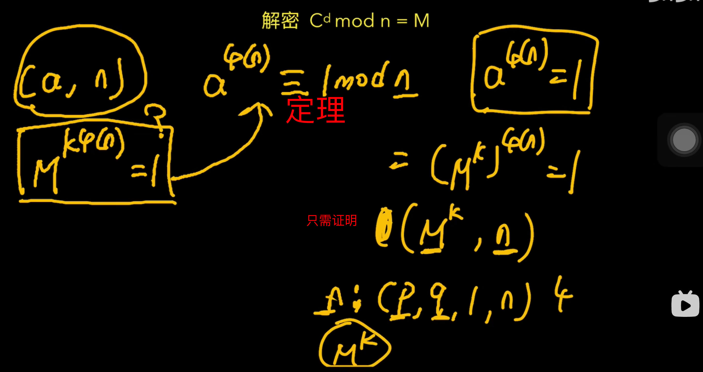
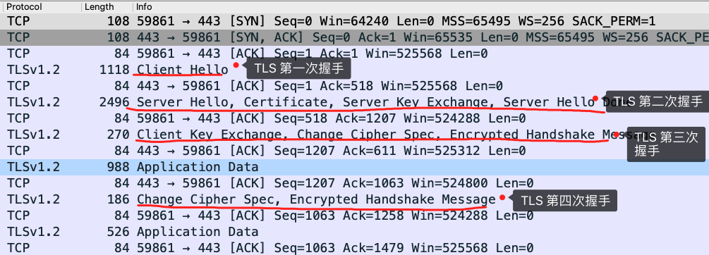

# 密码学原理

## 复习一下 RSA

基于大整数质因数分解困难的问题。

加解密过程

**深入分析：**

欧拉函数：

p,q是用来生成公私钥，私钥e 与欧拉函数的值互质。 根据私钥可以算出公钥。 通过的是模反操作    e*d (mod fi N) =1 

**模反操作：**

解密过程证明：

定理： a,n互质 那么有 右边那个欧拉定理

我们要证明 M^(k * fi N)  mod n =1     带入欧拉定理    就是要证明 M^k 与 n互质

> 关于M^k与n为什么互质部分：我的理解是当k>=2时，M^k必然不是质数，则不等于q,p；也不会等于两个互质的数乘积n。当k==1时，仅当M与q或p相等时M不与n互质，违背了q和p为大质数的前提......p.q为大质数就是为了防止与M发生碰撞。

RSA 是比较传统的密钥交换算法，它不具备前向安全的性质，因此现在很少服务器使用的。而 ECDHE 算法具有前向安全，所以被广泛使用。

## DH算法

DH 算法是非对称加密算法， 因此它可以用于密钥交换，该算法的核心数学思想是**离散对数问题**。

**特别是当模数 p 是一个很大的质数，即使知道底数 a 和真数 b ，在现有的计算机的计算水平是几乎无法算出离散对数的，这就是 DH 算法的数学基础。**

现假设小红和小明约定使用 DH 算法来交换密钥，那么基于离散对数，小红和小明需要先确定模数和底数作为算法的参数，这两个参数是公开的，用 P 和 G 来代称。

然后小红和小明各自生成一个随机整数作为**私钥**，双方的私钥要各自严格保管，不能泄漏，小红的私钥用 a 代称，小明的私钥用 b 代称。

现在小红和小明双方都有了 P 和 G 以及各自的私钥，于是就可以计算出**公钥**：

- 小红的公钥记作 A，A = G ^ a ( mod P )；
- 小明的公钥记作 B，B = G ^ b ( mod P )；

**先生成私钥 a,b  在算出公钥 A B**

## ECC椭圆曲线

基于椭圆曲线的离散对数问题。

椭圆曲线

计算A+B  A+A的过程

**加解密过程**

保证在有限域上

算加法套公式

有限域上计算   可以先倍数再加法

## ECC椭圆曲线与三次握手

**使用了 ECDHE，在 TLS 第四次握手前，客户端就已经发送了加密的 HTTP 数据**，而对于 RSA 握手过程，必须要完成 TLS 四次握手，才能传输应用数据。

DH 交换密钥时就只有客户端的公钥是变化，而服务端公钥是不变的，那么随着时间延长，黑客就会截获海量的密钥协商过程的数据，因为密钥协商的过程有些数据是公开的，黑客就可以依据这些数据暴力破解出服务器的私钥，然后就可以计算出会话密钥了，于是之前截获的加密数据会被破解，所以 **static DH 算法不具备前向安全性**。

既然固定一方的私钥有被破解的风险，那么干脆就让双方的私钥在每次密钥交换通信时，都是随机生成的、临时的，这个方式也就是 DHE  /ECDHE 算法，E 全称是 ephemeral（临时性的）。

所以，即使有个牛逼的黑客破解了某一次通信过程的私钥，其他通信过程的私钥仍然是安全的，因为**每个通信过程的私钥都是没有任何关系的，都是独立的，这样就保证了「前向安全」**。

 ==**TLS 第一次握手**==

客户端首先会发一个「**Client Hello**」消息，消息里面有客户端使用的 TLS 版本号、支持的密码套件列表，以及生成的**随机数（\*Client Random\*）**。

==**TLS 第二次握手**==

服务端收到客户端的「打招呼」，同样也要回礼，会返回「**Server Hello**」消息，消息面有服务器确认的 TLS 版本号，也给出了一个**随机数（\*Server Random\*）**，然后从客户端的密码套件列表选择了一个合适的密码套件。

- 密钥协商算法使用 ECDHE；

- 签名算法使用 RSA；

- 握手后的通信使用 AES 对称算法，密钥长度 256 位，分组模式是 GCM；

- 摘要算法使用 SHA384；

  

接着，服务端为了证明自己的身份，发送「**Certificate**」消息，会把证书也发给客户端

这一步就和 RSA 握手过程有很大到区别了，因为服务端选择了 ECDHE 密钥协商算法，所以会在发送完证书后，发送「**Server Key Exchange**」消息。

这个过程服务器做了三件事：

- 选择了**名为 x25519 的椭圆曲线**，选好了椭圆曲线相当于椭圆曲线基点 G 也定好了，这些都会公开给客户端；
- 生成随机数作为服务端椭圆曲线的私钥，保留到本地；
- 根据基点 G 和私钥计算出**服务端的椭圆曲线公钥**，这个会公开给客户端。

为了保证这个椭圆曲线的公钥不被第三方篡改，服务端会用 RSA 签名算法给服务端的椭圆曲线公钥做个签名。

随后，就是「**Server Hello Done**」消息，服务端跟客户端表明：“这些就是我提供的信息，打招呼完毕”。

至此，TLS 两次握手就已经完成了，目前客户端和服务端通过明文共享了这几个信息：**Client Random、Server Random 、使用的椭圆曲线、椭圆曲线基点 G、服务端椭圆曲线的公钥**，这几个信息很重要，是后续生成会话密钥的材料。

**==TLS 第三次握手==**

客户端收到了服务端的证书后，自然要校验证书是否合法，如果证书合法，那么服务端到身份就是没问题的。校验证书的过程会走证书链逐级验证，确认证书的真实性，再用证书的公钥验证签名，这样就能确认服务端的身份了，确认无误后，就可以继续往下走。

客户端会生成一个随机数作为客户端椭圆曲线的私钥，然后再根据服务端前面给的信息，生成**客户端的椭圆曲线公钥**，然后用「**Client Key Exchange**」消息发给服务端。

至此，双方都有对方的椭圆曲线公钥、自己的椭圆曲线私钥、椭圆曲线基点 G。于是，双方都就计算出点（x，y），其中 x 坐标值双方都是一样的，前面说 ECDHE 算法时候，说 x 是会话密钥，**但实际应用中，x 还不是最终的会话密钥**。

还记得 TLS 握手阶段，客户端和服务端都会生成了一个随机数传递给对方吗？

**最终的会话密钥，就是用「客户端随机数 + 服务端随机数 + x（ECDHE 算法算出的共享密钥） 」三个材料生成的**。

之所以这么麻烦，是因为 TLS 设计者不信任客户端或服务器「伪随机数」的可靠性，为了保证真正的完全随机，把三个不可靠的随机数混合起来，那么「随机」的程度就非常高了，足够让黑客计算不出最终的会话密钥，安全性更高。

算好会话密钥后，客户端会发一个「**Change Cipher Spec**」消息，告诉服务端后续改用对称算法加密通信。

接着，客户端会发「**Encrypted Handshake Message**」消息，把之前发送的数据做一个摘要，再用对称密钥加密一下，让服务端做个验证，验证下本次生成的对称密钥是否可以正常使用。

==**TLS 第四次握手**==

最后，服务端也会有一个同样的操作，发「**Change Cipher Spec**」和「**Encrypted Handshake Message**」消息，如果双方都验证加密和解密没问题，那么握手正式完成。于是，就可以正常收发加密的 HTTP 请求和响应了。

------

**==总结==**

RSA 和 ECDHE 握手过程的区别：

- RSA 密钥协商算法「不支持」前向保密，ECDHE 密钥协商算法「支持」前向保密；
- 使用了 RSA 密钥协商算法，TLS 完成四次握手后，才能进行应用数据传输，而对于 ECDHE 算法，客户端可以不用等服务端的最后一次 TLS 握手，就可以提前发出加密的 HTTP 数据，节省了一个消息的往返时间（这个是 RFC 文档规定的，具体原因文档没有说明，所以这点我也不太明白）；
- 使用 ECDHE， 在 TLS 第 2 次握手中，会出现服务器端发出的「Server Key Exchange」消息，而 RSA 握手过程没有该消息；

## **比特币脚本篇**

https://blog.csdn.net/Mu_Xiaoye/article/details/104364191

