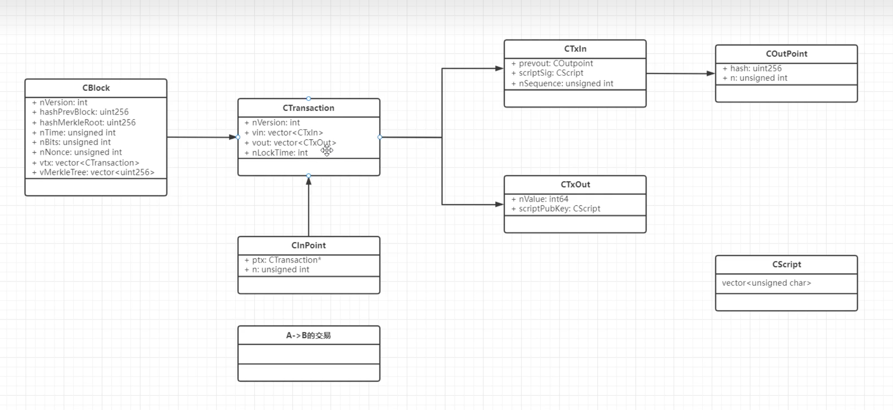
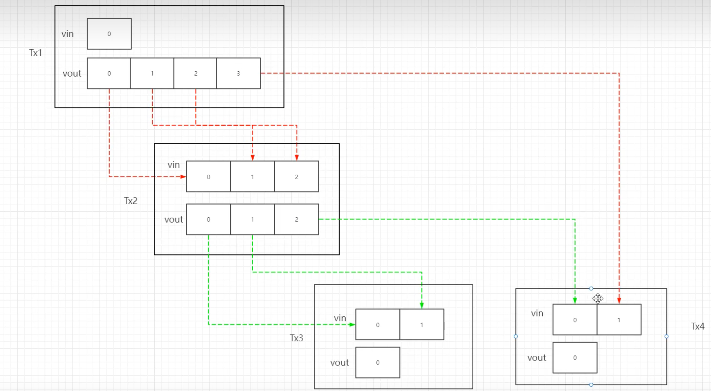
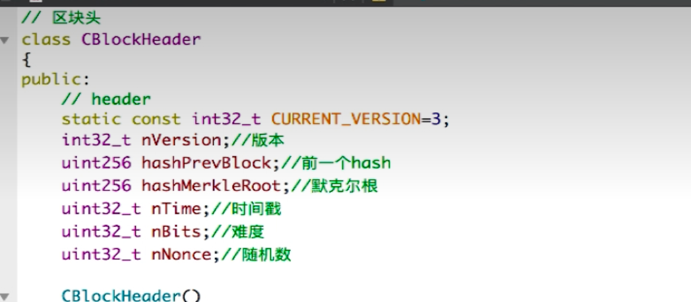
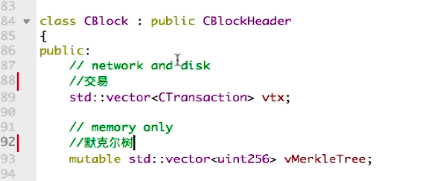
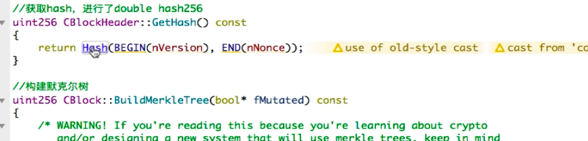
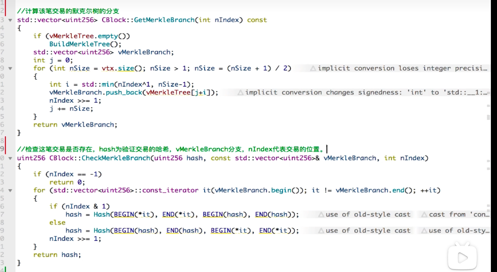
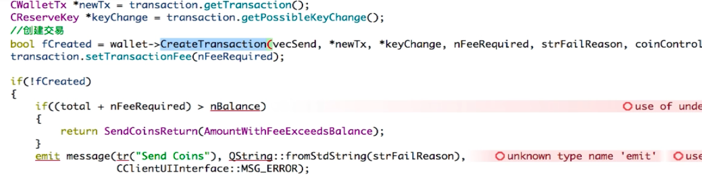
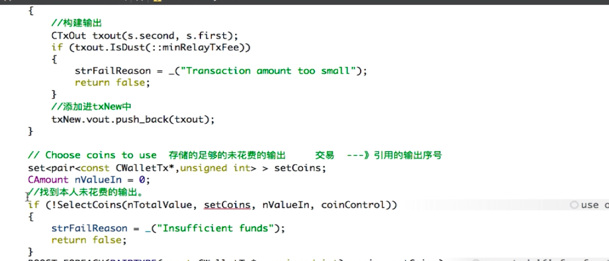
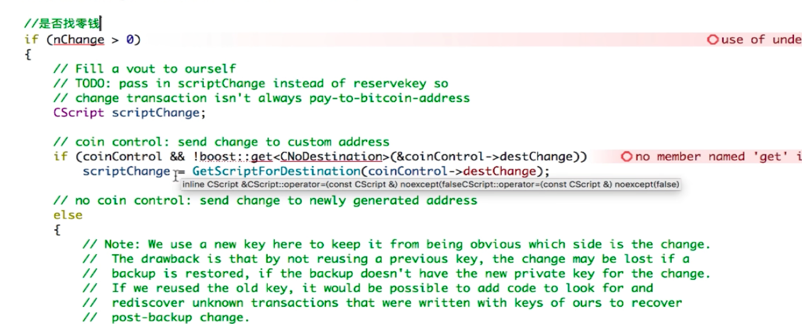
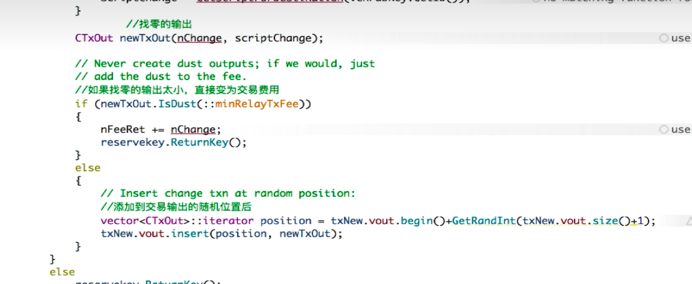

**Github代码地址**：https://github.com/trottier/original-bitcoin


# 1.比特币启动流程

使用了wxApp ui库

继承了	wxApp类  ，重写了onInit 方法

使用`IMPLEMENT_APP`泓，会在合适的时候启动CMYAPP 实例

```c
// Define a new application
class CMyApp: public wxApp    //
{
  public:
    CMyApp(){};
    ~CMyApp(){};
    bool OnInit();
    bool OnInit2();
    int OnExit();

    // 2nd-level exception handling: we get all the exceptions occurring in any
    // event handler here
    virtual bool OnExceptionInMainLoop();

    // 3rd, and final, level exception handling: whenever an unhandled
    // exception is caught, this function is called
    virtual void OnUnhandledException();

    // and now for something different: this function is called in case of a
    // crash (e.g. dereferencing null pointer, division by 0, ...)
    virtual void OnFatalException();
};

IMPLEMENT_APP(CMyApp)   // 宏 

bool CMyApp::OnInit()
{
    try
    {
        return OnInit2();  // 初始化
    }
    catch (std::exception& e) {
        PrintException(&e, "OnInit()");
    } catch (...) {
        PrintException(NULL, "OnInit()");
    }
    return false;
}

```


进入OnInit2（） 启动实例 ， 创建主窗口

关键代码

```c
    //
    // Create the main frame window
    //
    {
        pframeMain = new CMainFrame(NULL);
        pframeMain->Show();

        if (!StartNode(strErrors))  // 启动节点  是否开启节点
            wxMessageBox(strErrors);

        if (fGenerateBitcoins)   // 是否开启挖矿   全局变量
            if (_beginthread(ThreadBitcoinMiner, 0, NULL) == -1)   //启动挖矿线程
                printf("Error: _beginthread(ThreadBitcoinMiner) failed\n");

```


启动节点 StartNode（）

```c

    //
    // Start threads
    //
    if (_beginthread(ThreadSocketHandler, 0, new SOCKET(hListenSocket)) == -1)
    {
        strError = "Error: _beginthread(ThreadSocketHandler) failed";
        printf("%s\n", strError.c_str());
        return false;
    }

    if (_beginthread(ThreadOpenConnections, 0, NULL) == -1)
    {
        strError = "Error: _beginthread(ThreadOpenConnections) failed";
        printf("%s\n", strError.c_str());
        return false;
    }

    if (_beginthread(ThreadMessageHandler, 0, NULL) == -1)
    {
        strError = "Error: _beginthread(ThreadMessageHandler) failed";
        printf("%s\n", strError.c_str());
        return false;
    }

    return true;
```

启动几个线程

ThreadSocketHandler 处理网络相关

ThreadOpenConnections处理连接相关

ThreadMessageHandler 核心的处理逻辑


ThreadMessageHandler  -》 ThreadMessageHandler2

```c
void ThreadMessageHandler2(void* parg)
{
    printf("ThreadMessageHandler started\n");
    SetThreadPriority(GetCurrentThread(), THREAD_PRIORITY_BELOW_NORMAL);
    loop
    {
        // Poll the connected nodes for messages
        vector<CNode*> vNodesCopy;
        CRITICAL_BLOCK(cs_vNodes)
            vNodesCopy = vNodes;
        foreach(CNode* pnode, vNodesCopy)
        {
            pnode->AddRef();

            // Receive messages
            TRY_CRITICAL_BLOCK(pnode->cs_vRecv)
                ProcessMessages(pnode); //处理消息

            // Send messages
            TRY_CRITICAL_BLOCK(pnode->cs_vSend)
                SendMessages(pnode); // 发送消息

            pnode->Release();
        }

        // Wait and allow messages to bunch up
        vfThreadRunning[2] = false;
        Sleep(100);
        vfThreadRunning[2] = true;
        CheckForShutdown(2);
    }
}
```


# 2.UTXO

UTXO  为花费的交易输出 

数据结构

```c
//
// The basic transaction that is broadcasted on the network and contained in
// blocks.  A transaction can contain multiple inputs and outputs.
//
// 基础交易在网络上广播 ， 一个交易可以包含多个输入和输出
class CTransaction
{
public:
    int nVersion;
    vector<CTxIn> vin;  // 比特币从哪里来
    vector<CTxOut> vout; //Vout 转给谁 转多少
    int nLockTime;
```


```c
//
// An input of a transaction.  It contains the location of the previous
// transaction's output that it claims and a signature that matches the
// output's public key.
//
// 交易输入包含它拥有的前一比交易的输出的位置，以及与该输出公钥匹配的签名
class CTxIn
{
public:
    COutPoint prevout;  // 上一笔交易输出位置
    CScript scriptSig;  // 上一个人签名
    unsigned int nSequence;
```


```c
//
// An output of a transaction.  It contains the public key that the next input
// must be able to sign with to claim it.
//
// 交易的输出。 它包含   下一个输入必须能够签名才能拥有的公钥
class CTxOut
{
public:
    int64 nValue; // 输出的价值  转多少钱
    CScript scriptPubKey; // 公钥   pay to public key  可以理解为转账给谁
```


**关系图**






# 3.区块、区块头、默克尔树

BlockHeader





RLP(Recursive Length Prefix,递归的长度前缀)     序列化方法



给出改比交易的索引，即可拿到该笔交易的分值



传入要验证的交易hash   以及改交易所在的分支，(nIndex的作用 可以看出来是根据奇偶来使用不同的方法计算) 验证是否存在


# 4.交易、交易费用



与wallet类绑定


 







